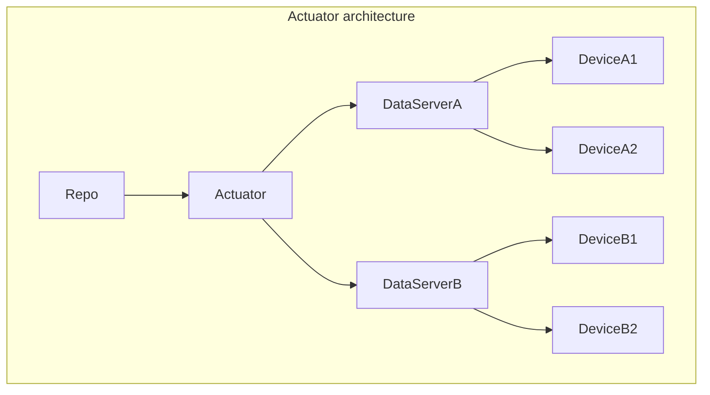

## option

## branch

- trigger: when a certain comment is set
- Assumption: there should not be a merge conflict -> should be checked before a comment is set
applying to the network (rollout): 
- failure: add the failure info as a comment (network will be reverted to the previous state)
- success: merge to main
- Rollback: coming from main
- Roll forward: coming from branch
- Challenge: multiple branches in parallel -> sequence them as you can have merge conflicts
- Rollout strategy is in the code

## main

- trigger when main HEAD changes
- applying to the network (rollout): 
failure: add the failure info as a comment to commit (network will be reverted to the previous state)
- success: add comment to commit
- Rollback: coming from main and check comments (only success comments can rollback)
- Roll forward: new HEAD
- Challenge: main is a mix and when doing rollback, you need a new MR to get back going

## branch solution

- repo
    - rollout (strategy: network-wide, canary, ...)
    - per device
        - full config -> (SW Version A, B, C)
        - config snippet(s) -> (SW Version A, B, C)

Rollforward: new Reference with the branch as a reference
    - rollout strategy defined by Rollout CR in the repo
    - rollout controller implements the rollout
    - if OK: 
        - Write the config snippets in the Database (all versions)
        - Merge to main

Rollbackward: new Reference with main as Refreence
    - rollout strategy -> network wide
    - rollout controller implements the rollout
    - if OK: 
        - Write the config snippets in the Database (all versions)
        - Merge to main

Software upgrade/downgrade (handled by other entity -> meaning the pieces that is taking care of upgrading the node)
    - target comes back up
        - takes the SW version that is discovered -> reimplement the config
            - look at applied configs with the respective SW version -> if so reimplement these
            - if no applied configs were found that match the SW version -> transact all configs that match the sw version

# implementation

- Reference controller
    - watches ConfigReference CR -> decides rollback or rollforward based on the git reference info (main or branch)
        - new change:
            - look at all the configs
        - rollback:
            - take the full config config CR(s) -> apply to the cluster
- Rollout controller
    - based on the rollout CR -> implement the change
        - network wide -> success or failure; retries, etc etc

## components

